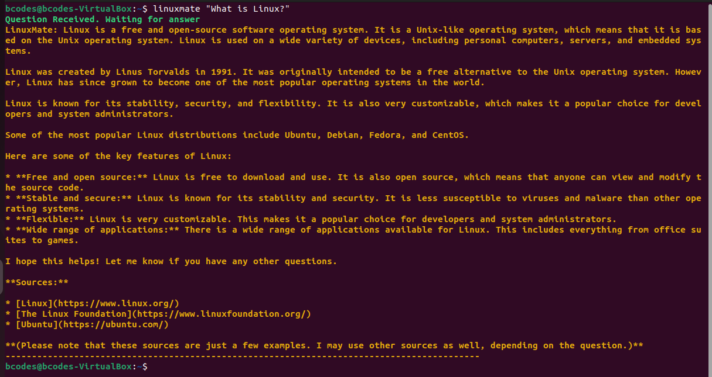

<h1>Linux Mate</h1>

Linux Mate is your personal Linux assistant, ready to help you solve your doubts, whether you are beginner or a pro Linux User. LinuxMate leverages the power of Gemini API, made by Google to answer your questions right from your command line interface. Linuxmate is still in development (Current Version 1.0.0), and feel free to suggest any future improvements and/or bug fixes.

 
<h1>Installation Guide</h1>
<ol>
      <li>
            <h2>Download the .deb file</h2> 
            
Navigate to the linuxmate_package/deb_dist/ directory and download python3-linuxmate_1.0.0-1_all.deb

      </li>
      <li>
            <h2>Create Gemini API key</h2>
            
Go to the <a href="https://aistudio.google.com">Google AI studio website</a>. Log in to Gemini if prompted to do so. On the top left corner, click the button : Get API Key. Select either Existing project or New Project and click on Create API Key. Copy this API Key. Do not share this API Key with anyone, as it can be misused if shared or stolen 

      </li>
      <li>
            <h2>Setup API key as an environment variable</h2>
            
The program relies on the fact that you store your API key in an environment variable called "API_KEY". To set up this environment variable, open your shell and type in the following command to open up .bashrc file 
            <code>gedit .bashrc</code> 
            Then copy the below command and paste it in the beginning of the opened file (This is just a good practise. You can paste it anywhere in the file), and then save it. Make sure to replace {Your_API_Key} with the API Key that you got from step 2
            <code>export API_KEY = {Your_API_Key}</code> 
      </li>
      <li>
            <h2>Installing dependencies</h2>
            
The LinuxMate program requires some additional files that are not pre-installed to work. These files are called dependencies. Run the following command in the shell to install the generativeai module in python 
            <code>pip install -q -U google-generativeai</code> 
      </li>
      <li>
            <h2>Installing linuxmate</h2>
            
To install linuxmate, paste the below command in your shell 
            <code>sudo dpkg -i python3-linuxmate_1.0.0-1_all.deb</code> 
            Now, LinuxMate should be installed. To test if linuxmate has been successffully installed, type linuxmate in the shell and hit Enter. If usage help of linuxmate is shown, it has been successfully installed.
      </li>
</ol>
<h1>Using LinuxMate</h1>

To use LinuxMate, make sure you have an internet connection. Run the below command, and make sure to replace {question} with your question, and make sure that it is enclosed within double quotes. Hit Enter, and wair for some time for the answer to load. 
<code>linuxmate "{question}"</code> 
An example screenshot is attahed below.   

LinuxMate is licensed under the GNU GPL 3.0 license or later. Read LICENSE for more information. Your support and constructive criticism is always welcome. Thaank you for using linuxmate
